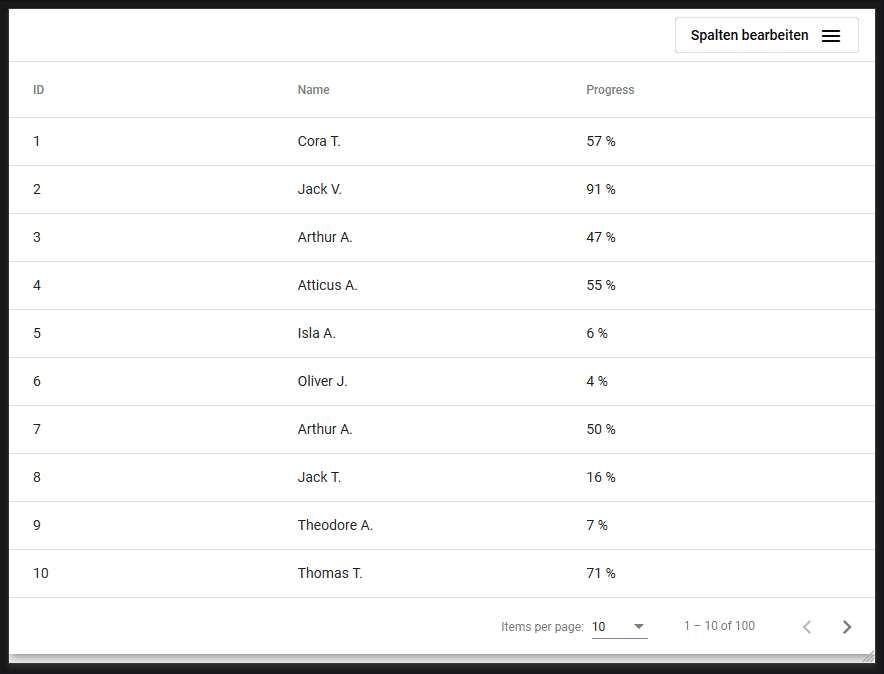

# NgxMultiSortTable

This is the implementation for a multiple sortable table based on the Angluar Material Design. The focus is on server-side loaded and sorted data. Next to that the libarry provides some unsefull classes to reduce the duplicated code when useing the material `paginator`.
The code is based on [Francisco Arantes Rodrigues](https://github.com/farantesrodrigues) repository [repo](https://github.com/farantesrodrigues/ng-mat-multi-sort), so thanks for your great work.

~~The provied example is based on **Angular 8 and Angular Material 8**, I have not tested previous or later versions.~~
I am happy to annouce the angular 10 version of this library, special credits go to [Dominik](https://github.com/Dafnik), who made this possible. If you still need the angular 8 version, you can build it locally (there is a angular 8 branch) or just use version 1.9 this the latest angular 8 version.

Client side multi sorting is not implementes yet, it might follow in the future or feel free to make a pull request.

## Demo
To run the demo:
1.  `clone` the repository
2. `cd ngx-multi-sort-table`
3. `npm install`
4. `ng build multi-sort-table`
5. `ng serve`

## Screenvideo


## Documentation
### TableData
The `TabelData` an an usefull class, which handels a lot of work for your app, such as page events (`next`, `previous`, `sizeChange`) and sorting event. Next to that it keeps the current state of the table, again sorting and pagnation.

#### Properties

| Name               | Description                                                                                                                                           | default                          | Exampe                                       |
| ------------------ | ----------------------------------------------------------------------------------------------------------------------------------------------------- | -------------------------------- | -------------------------------------------- |
| columns            | An array of the displayed columns of the table with `id`: name of the attribute and `name`: Name to display in the header                             | `none`                           | `[{ id: 'first_name', name: 'First Name' }]` |
| displayedColumns   | An array of the currently displayed columns (`id`) and their order                                                                                    | `all columns`                    |                                              |
| dataSource         | A `MatMultiSortTableDataSource`, which is special `DataSource` for sorting                                                                            | `none`                           |                                              |
| pageSize           | The current selected pageSize                                                                                                                         | first entry of `pageSizeOptions` |                                              |
| pageSizeOptions    | The options for the pageSize, which the user can see in the menu                                                                                      | `[10, 20, 50, 100]`              |                                              |
|                    |                                                                                                                                                       |                                  |                                              |
| pageIndex          | The index of the page                                                                                                                                 | `0`                              |                                              |
| totalElements      | The total number of elemnts of the table, must be set from your component                                                                             | `none`                           |                                              |
| sortParams         | An Array of the columns (`id`), which the user had chosen to sort. The order of the sorting is represented by the order of the `id`s in the parameter | `[]`                             | `['first_name', 'last_name']`                |
| sortDirs           | An Array of the column's sortdirections, which the user had chosen to sort. The order is the same like `sortParams`                                   | `[]`                             | `['asc', 'desc']`                            |
| nextObservable     | An `Observable` that fires, when the user clicks the `next` button                                                                                   |                                  |                                              |
| previousObservable | An `Observable` that fires, when the user clicks the `previous` button                                                                               |                                  |                                              |
| sizeObservable     | An `Observable` that fires, when the user changes the `pageSize`                                                                                     |                                  |                                              |
| sortObservable     | An `Observable` that fires, when the user changes the sorted columns or direction                                                                    |                                  |                                              |

#### Methods

| Name                | Description                                                                                                                                                                               | Parameter                                                                                                                                               |
| ------------------- | ----------------------------------------------------------------------------------------------------------------------------------------------------------------------------------------- | ------------------------------------------------------------------------------------------------------------------------------------------------------- |
| constructor         | The constructor for the for the class, where you initalize your `columns` and the `totalElements`. Optionally, you can add the default `id`s of the default sort colum and direction.     | `columns`: string[], `totalElements`: number, `options`: { `defaultSortParams?`: string[], `defaultSortDirs?`: string[], `pageSizeOptions?`: number[] } |
| onSortEvent         | The method to bind to the `matSortChange` output of the table                                                                                                                             | none                                                                                                                                                    |
| onPagnationEvent    | The method to bin to the `page` output of the `mat-paginator`                                                                                                                             | `$event`: PageEvent                                                                                                                                     |
| setDisplayedColumns | A method to set the columns of the table. It should get bind to the `activeColumnsChange` output of `mat-multi-sort-table-settings`, in order to enable / disable and reorder the columns | `columns`: string[]                                                                                                                                     |
|                     |                                                                                                                                                                                           |                                                                                                                                                         |

### MatMultiSortHeaderComponent
This component manages the sorting of the table. To use the multisort add `matMultiSort` to your table and pass the `mat-multi-sort-header="<your-column-id>"` to the `<th mat-header-cell>`.

### MatMultiSortTableSettingsComponent
This component display some settings for your table. The user can select the columns he wants to see in his table, next to that he can change the order of the columns.

| Name                | Description                                                                                                                  | Parameter                              |
| ------------------- | ---------------------------------------------------------------------------------------------------------------------------- | -------------------------------------- |
| columns             | An input to definde the columns to display in the menu. The `id` is the column id and `name` the name to display in the menu | @Input: { id: string, name: string }[] |
| activeColumnsChange | The ouput gives the order of th currently display columns `id` and their order                                               | @Output: string[]                      |

## Example code for the template
```html
<div class="mat-elevation-z8">
  <mat-multi-sort-table-settings [columns]="table.columns" (activeColumnsChange)="table.setDisplayedColumns($event)"></mat-multi-sort-table-settings>
  <table mat-table [dataSource]="table.dataSource" matMultiSort  (matSortChange)="table.onSortEvent()">
    <ng-container matColumnDef="id">
      <th mat-header-cell *matHeaderCellDef mat-multi-sort-header="id"> ID </th>
      <td mat-cell *matCellDef="let row"> {{row.id}} </td>
    </ng-container>

    <ng-container matColumnDef="progress">
      <th mat-header-cell *matHeaderCellDef mat-multi-sort-header="progress"> Progress </th>
      <td mat-cell *matCellDef="let row"> {{row.progress}} % </td>
    </ng-container>

    <ng-container matColumnDef="name">
      <th mat-header-cell *matHeaderCellDef mat-multi-sort-header="name"> Name </th>
      <td mat-cell *matCellDef="let row"> {{row.name}} </td>
    </ng-container>

    <tr mat-header-row *matHeaderRowDef="table.displayedColumns"></tr>
    <tr mat-row *matRowDef="let row; columns: table.displayedColumns;"></tr>
  </table>
  <mat-paginator [pageSize]="table.pageSize" [pageIndex]="table.pageIndex" [pageSizeOptions]="table.pageSizeOptions"
    [length]="table.totalElements ? table.totalElements : 0" (page)="table.onPagnationEvent($event)">
  </mat-paginator>
</div>
```
## Example code for the component.ts

```typescript
  displayedColumns = ['id', 'name', 'progress'];

  table: TableData<UserData>;
  @ViewChild(MatMultiSort, { static: false }) sort: MatMultiSort;

  constructor(
    private dummyService: DummyService
  ) {
    this.table = new TableData<UserData>(
      [
        { id: 'id', name: 'ID' },
        { id: 'name', name: 'Name' },
        { id: 'progress', name: 'Progess' }
      ], 100
    );

  }

  ngOnInit() {
    this.table.sortObservable.subscribe(() => { this.getData(); });
    this.table.nextObservable.subscribe(() => { this.getData(); });
    this.table.previousObservable.subscribe(() => { this.getData(); });
    this.table.sizeObservable.subscribe(() => { this.getData(); });

    setTimeout(() => {
      this.table.dataSource = new MatMultiSortTableDataSource(this.sort);
      this.getData();
    }, 0);
  }

  getData() {
    const res = this.dummyService.list(this.table.sortParams, this.table.sortDirs, this.table.pageIndex, this.table.pageSize);
    this.table.totalElements = res.totalElements;
    this.table.pageIndex = res.page;
    this.table.pageSize = res.pagesize;
    this.table.data = res.users;
  }
```

